<div align="center">

# 🧘 YogaPro

**The right yoga video, at the right moment — every time.**

*A personal AI-powered yoga companion that deeply understands every video in your favorite instructor's library, then matches the right one to how you feel right now.*

[](https://php.net)
[](https://laravel.com)
[](https://mysql.com)
[](https://deepmind.google/technologies/gemini/)
[](https://tailwindcss.com)

</div>

---

## The Problem

You've found a yoga instructor you love. Their library has hundreds of videos. But every time you want to practice, you spend 10 minutes scrolling — trying to remember which video was the gentle one, which one wrecked your lower back, which one had that flow you loved after a stressful day.

**YogaPro solves this.** It watches every video so you don't have to remember them.

---

## What It Does

YogaPro builds a **deep, structured understanding** of every video in a YouTube yoga channel. For each video, it knows:

- **Every pose** — identified by name, with timestamps
- **How long** each pose is held
- **How demanding** the transitions are between poses
- **Which body areas** each pose targets
- **Back-pain safety** — whether each pose helps, is neutral, or should be avoided
- **Your personal history** with each pose — your ratings, discomfort flags, avoidances

Then, when you want to practice, it asks three simple questions:

> *What's going on with your body today?*
> *How much energy do you have?*
> *How much time do you have?*

...and gives you the right video.

---

## Screenshots

### Moment Finder — Body Check-in

Tell YogaPro what your body needs today. Select the areas you want to work or that feel tight. Set your energy level and how much time you have.

<table>
<tr>
<td>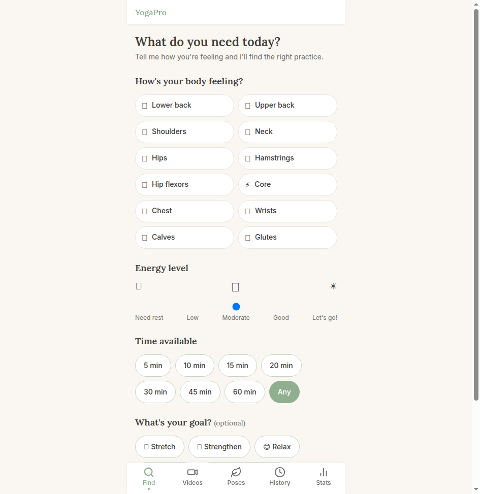</td>
<td>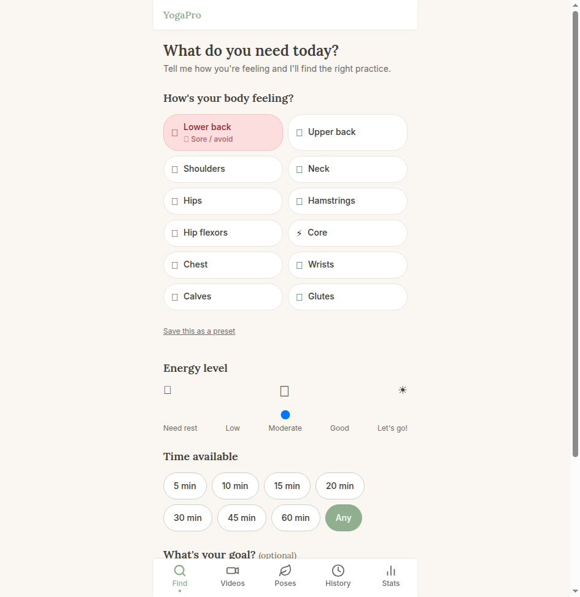</td>
<td>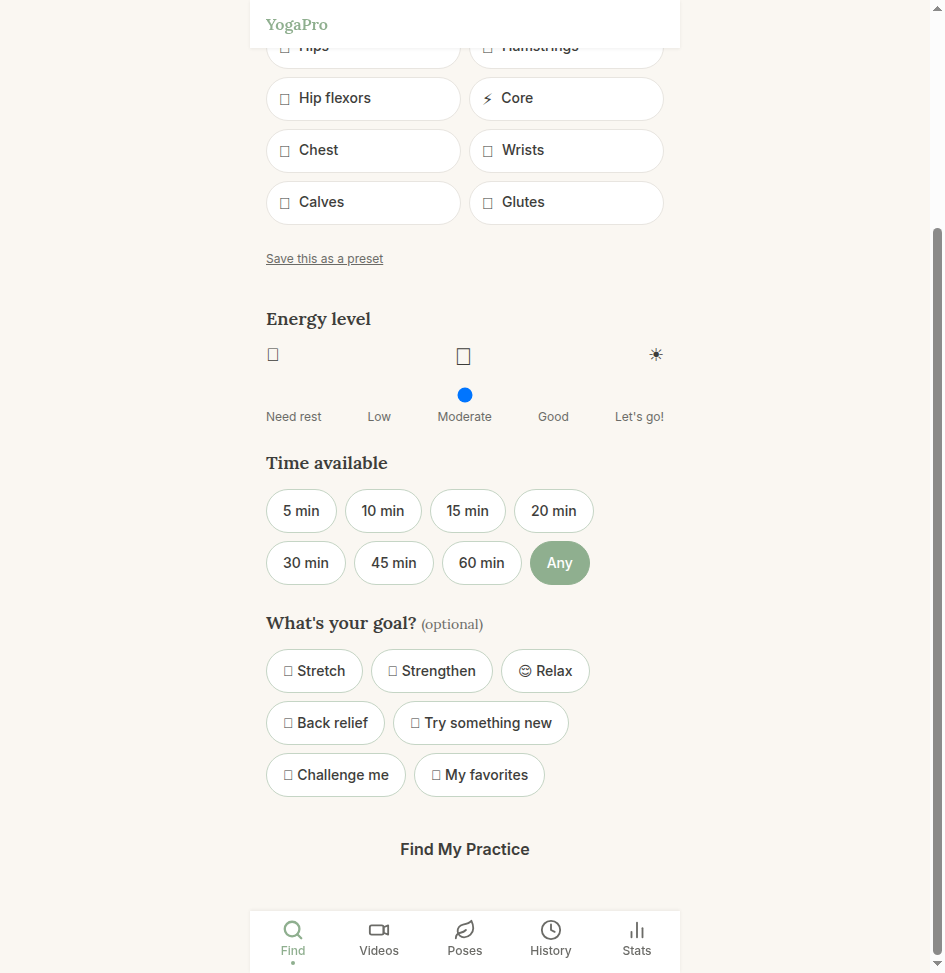</td>
</tr>
</table>

### Recommendations

Results are ranked by a multi-factor engine (safety, body area match, energy level, duration, your history, pose familiarity). Each result shows **why** it was recommended — as readable chips.

<table>
<tr>
<td>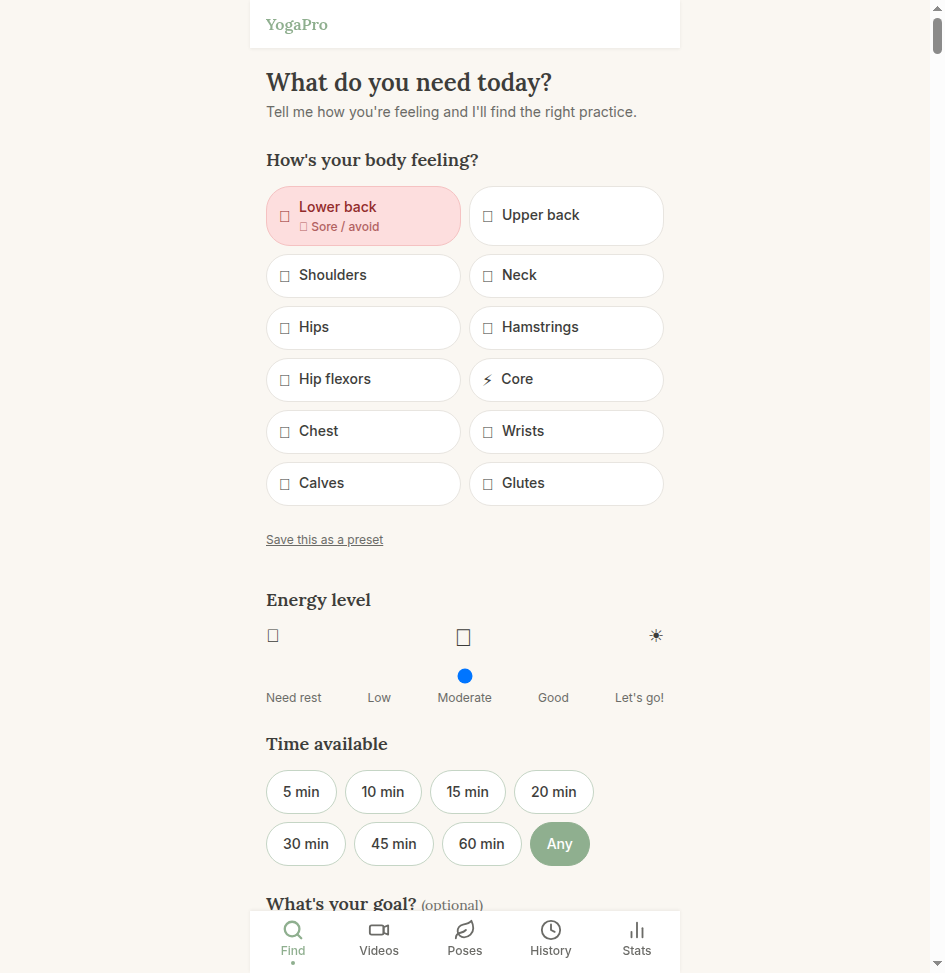</td>
<td>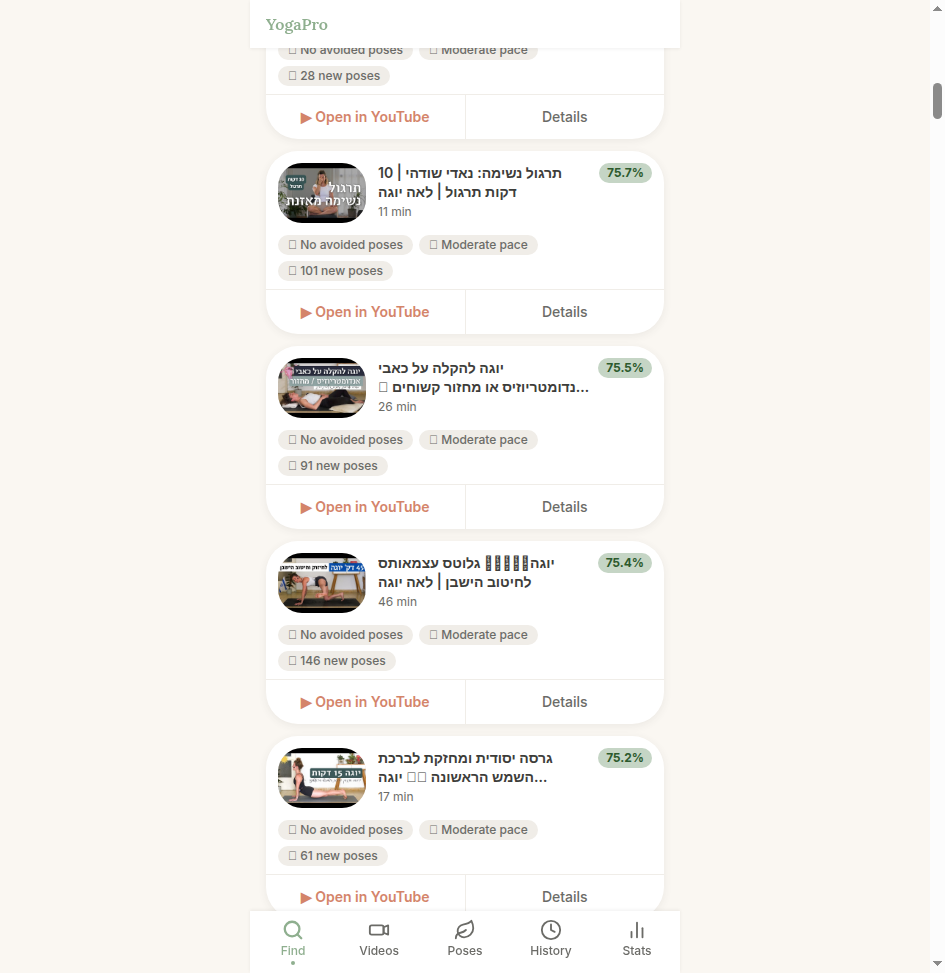</td>
</tr>
</table>

### Video Detail — Pose Timeline

Every analyzed video has a full **pose timeline** — a chronological breakdown of every move with timestamps, duration, and body area indicators. Tap any pose for details.

<table>
<tr>
<td>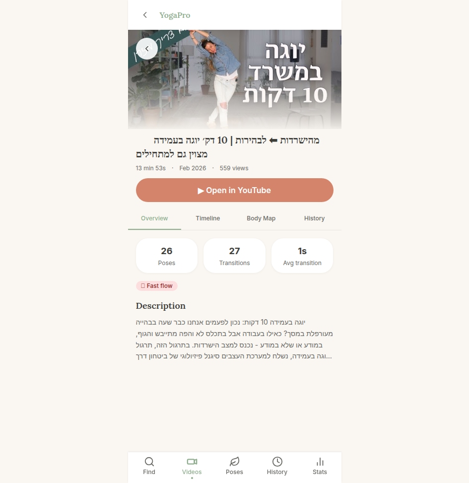</td>
<td>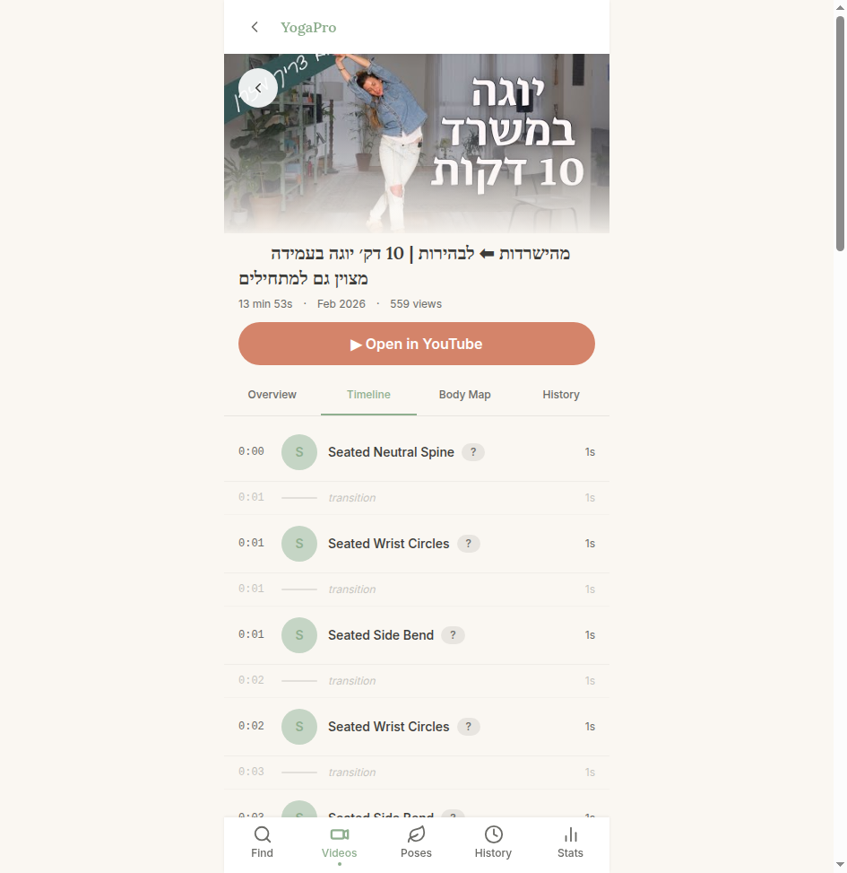</td>
</tr>
</table>

### Pose Library

Browse and filter all 1,300+ poses extracted across the entire channel. See which videos each pose appears in, rate your personal comfort, flag poses to avoid, and add notes.

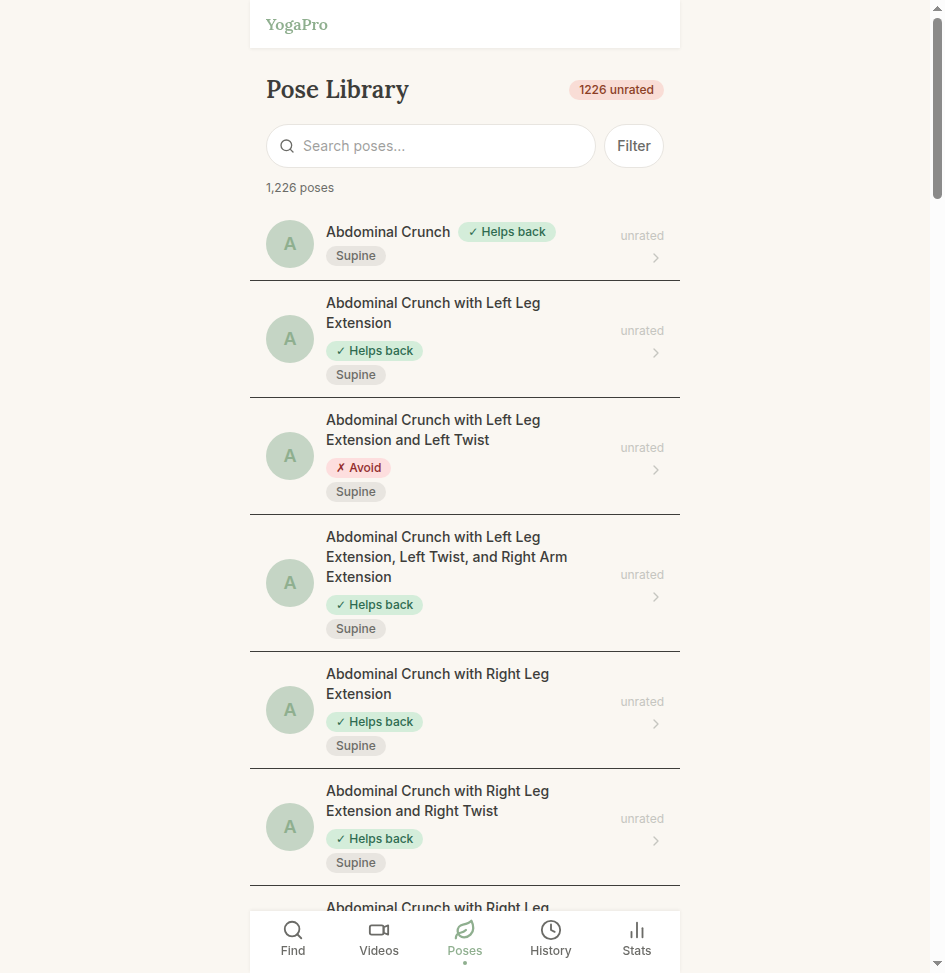

### Session History & Logging

Log your practice sessions with body state, energy level, goals, and per-pose feedback. The app learns from your sessions over time — adjusting what it recommends based on what worked (and what didn't).

<table>
<tr>
<td>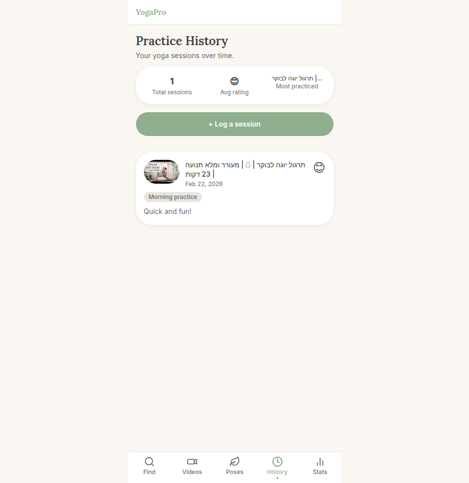</td>
<td>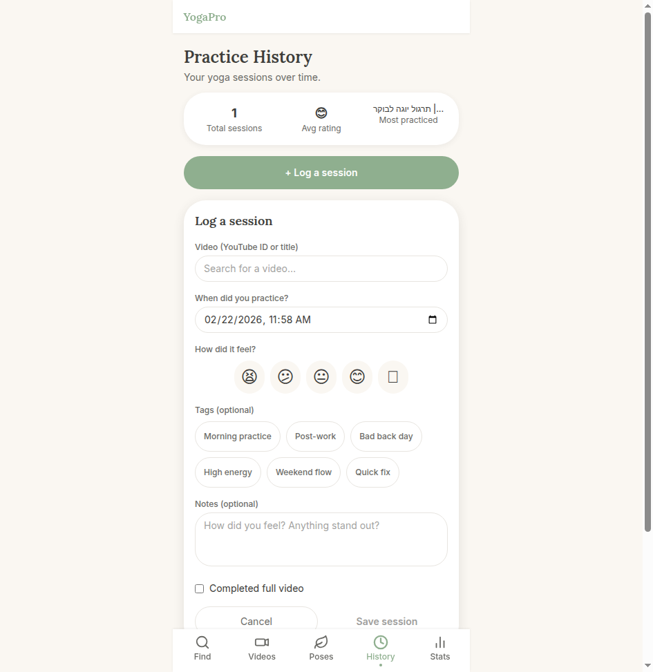</td>
</tr>
</table>

### Pipeline Stats Dashboard

Real-time view of the analysis pipeline — videos analyzed, poses enriched, Gemini API token usage and cost, back-pain safety coverage, and queue health.

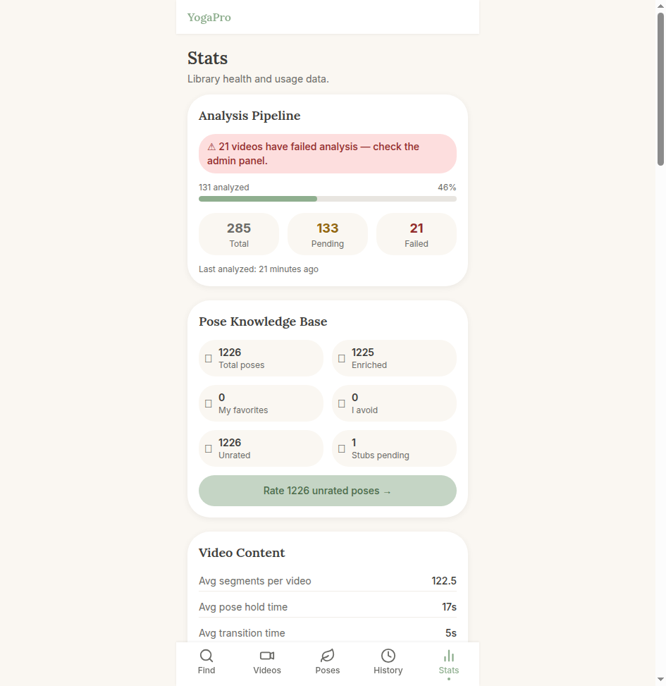

---

## How It Works

### Data Pipeline

```
YouTube API (daily cron)
    └── Discover new videos → store as pending
            └── videos:analyze (every 30 min)
                    └── Gemini 2.5 Flash (watches video at 0.5 fps)
                            └── Extracts: pose names, timestamps, transition types
                                    └── YogaMoveResolver
                                            ├── Match to known poses in DB
                                            └── New pose → EnrichYogaMoveJob
                                                    └── Gemini (text-only)
                                                            └── Body areas, benefits,
                                                                back-pain classification,
                                                                spinal actions, risks
```

### Recommendation Engine

```
POST /api/recommendations
    Input: body zones, energy (1–5), time range, goals
    │
    ├── Factor A: Safety       — avoided poses, zone risk, conditional avoidance
    ├── Factor B: Body area    — hold-duration-weighted zone relevance
    ├── Factor C: Duration     — match to time available
    ├── Factor D: Energy       — video flow speed vs your energy level
    ├── Factor E: Familiarity  — favourites bonus
    ├── Factor F: History      — session similarity (Jaccard zones + energy)
    └── Factor G: Recency      — penalty for recently watched
            └── Ranked results with explanation chips
```

---

## Key Features

| Feature | Detail |
|---|---|
| **AI Video Analysis** | Gemini 2.5 Flash watches each video at 0.5 fps, extracts structured pose+transition data |
| **Pose Knowledge Base** | 1,300+ poses enriched with body areas, benefits, spinal actions, contraindications |
| **Back-Pain Aware** | Every pose classified: helps / neutral / avoid for lower back, upper back, general |
| **Personal Overrides** | Your experience with each pose always wins over AI classification |
| **Learning Loop** | Post-session feedback updates pose avoidances and conditional preferences |
| **Smart Deduplication** | Bilateral poses (left/right), Cat-Cow sequences, and near-duplicates auto-merged |
| **Multi-Factor Scoring** | 7-factor recommendation engine with explainable output chips |
| **Mobile-First UI** | Designed for 430px — use it from your phone, mat-side |

---

## Tech Stack

| Layer | Technology |
|---|---|
| **Backend** | Laravel 11 (PHP 8.2) |
| **Database** | MySQL 8 |
| **AI** | Google Gemini 2.5 Flash (video + text) |
| **Queue** | Laravel Queue (database driver) + Supervisor |
| **Video Discovery** | YouTube Data API v3, yt-dlp fallback |
| **Frontend** | Blade + Tailwind CSS v4 + Alpine.js |
| **Design** | Mobile-first (max 430px), no auth (single-user) |

---

## App Pages

| Route | Page |
|---|---|
| `/` | Moment Finder — body check-in, energy, time → recommendations |
| `/videos` | Video browser — all analyzed videos |
| `/videos/{id}` | Video detail — pose timeline, body map, session history |
| `/poses` | Pose Library — browse, filter, rate 1,300+ poses |
| `/poses/{id}` | Pose detail — attributes, personal opinion, appears-in |
| `/history` | Session history + log a session |
| `/stats` | Pipeline stats, knowledge base, back-pain safety, API cost |
| `/admin` | Queue monitor, data browsers, manual pipeline triggers |

---

## Local Setup

### Prerequisites
- PHP 8.2+, Composer
- MySQL 8
- Node.js (for Tailwind CSS)
- Google Gemini API key
- YouTube Data API v3 key

### Install

```bash
git clone https://github.com/shanipeleg/YogaPro.git
cd YogaPro

composer install
npm install

cp .env.example .env
php artisan key:generate
```

### Configure `.env`

```env
DB_HOST=127.0.0.1
DB_DATABASE=yogapro
DB_USERNAME=yogapro
DB_PASSWORD=your_password

GEMINI_API_KEY=your_gemini_key
YOUTUBE_API_KEY=your_youtube_key
YOUTUBE_CHANNEL_ID=UCYIEmkLNyiUgtXdYmvIKvgw
```

### Migrate & seed

```bash
php artisan migrate
php artisan yoga:import-wiki   # Seed base pose knowledge
php artisan channel:scan       # Discover videos from YouTube
```

### Build assets & run

```bash
npm run build
php artisan serve
```

### Run the analysis pipeline

```bash
# Dispatch analysis jobs for pending videos (10–50 min videos only)
php artisan videos:analyze

# Enrich new pose stubs with Gemini
php artisan yoga:enrich

# Run the queue worker
php artisan queue:work
```

For production, use Supervisor to keep `queue:work` running. A daily cron calling `channel:scan` and `videos:analyze` will keep the pipeline running automatically.

---

## Artisan Commands

| Command | Description |
|---|---|
| `channel:scan` | Fetch new videos from YouTube, insert as pending |
| `videos:analyze` | Dispatch Gemini analysis jobs for unanalyzed videos |
| `yoga:enrich` | Enrich pending pose stubs via Gemini (text-only) |
| `yoga:import-wiki` | One-time bulk import of base poses |
| `yoga:deduplicate` | Merge near-duplicate poses (bilateral, aliases) |
| `yoga:consolidate-cat-cow` | Merge Cat→Cow consecutive sequences |
| `videos:prune-gimmicks` | Soft-delete off-topic videos (kids yoga, gear reviews, etc.) |

---

## Database Schema

Core tables: `channels`, `videos`, `video_segments`, `segment_moves`, `yoga_moves`, `user_move_opinions`, `user_sessions`, `session_move_flags`, `body_state_presets`, `video_analysis_log`.

See [`GAMEPLAN.md`](GAMEPLAN.md) for the full schema with column-level documentation.

---

## Why I Built This

I do yoga regularly. I have a favorite instructor with a huge video library. Choosing the right video for any given day was genuinely hard — especially managing lower back pain, where the wrong session can do more harm than good.

I wanted a tool that actually *knew* what was in each video, understood my body's needs, and could make a smart recommendation in seconds. So I built one.

---

<div align="center">
<sub>Built with Laravel · Powered by Gemini AI · For the mat</sub>
</div>
